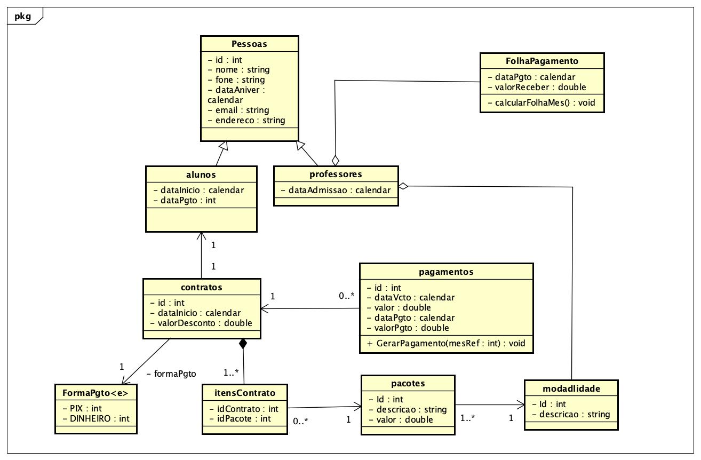

# Projeto LPOO: Sistema de Gestão de Estúdio de Dança

## Descrição do Projeto
O presente projeto refere-se ao desenvolvimento de um sistema Java utilizando JDBC e JPA para gerenciar o acesso a um banco de dados PostgreSQL. O projeto utiliza Maven como gerenciador de dependências e foi desenvolvido na disciplina de Linguagem de Programação Orientada a Objetos (LPOO) do curso de Bacharelado em Ciências da Computação do IFSUL, Câmpus Passo Fundo, durante o período letivo 2024-1.

Este projeto foi realizado em conjunto com a disciplina de APS por meio da análise de requisitos de um Estúdio de Dança na cidade de Passo Fundo.

## Modelagem Realizada
A modelagem do sistema incluiu as seguintes entidades e seus relacionamentos:

